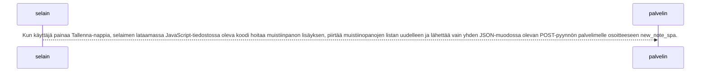

```mermaid
sequenceDiagram
selain -->> palvelin: Kun käyttäjä painaa Tallenna-nappia, selaimen lataamassa JavaScript-tiedostossa oleva koodi hoitaa muistiinpanon lisäyksen, piirtää muistiinopanojen listan uudelleen ja lähettää vain yhden JSON-muodossa olevan POST-pyynnön palvelimelle osoitteeseen new_note_spa.
```
