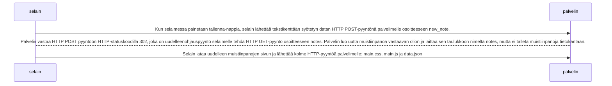

```mermaid
sequenceDiagram
selain ->> palvelin: Kun selaimessa painetaan tallenna-nappia, selain lähettää tekstikenttään syötetyn datan HTTP POST-pyyntönä palvelimelle osoitteeseen new_note. 
palvelin --> selain: Palvelin vastaa HTTP POST pyyntöön HTTP-statuskoodilla 302, joka on uudelleenohjauspyyntö selaimelle tehdä HTTP GET-pyyntö osoitteeseen notes. Palvelin luo uutta muistiinpanoa vastaavan olion ja laittaa sen taulukkoon nimeltä notes, mutta ei talleta muistiinpanoja tietokantaan.
selain ->> palvelin: Selain lataa uudelleen muistiinpanojen sivun ja lähettää kolme HTTP-pyyntöä palvelimelle: main.css, main.js ja data.json
```

