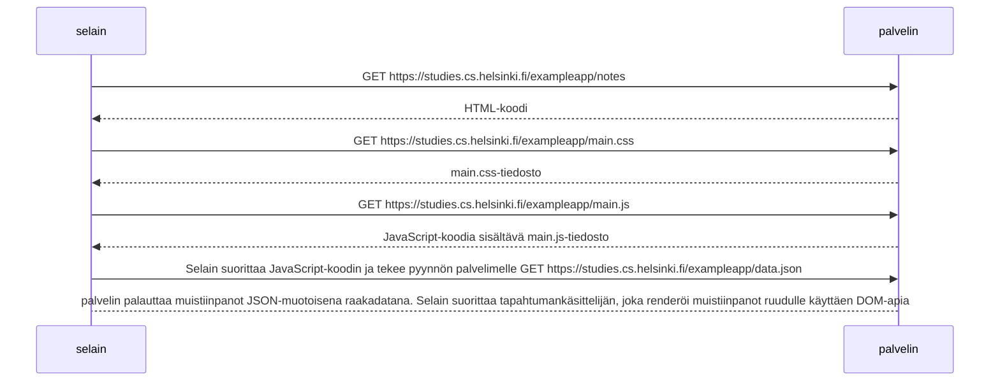

```mermaid
sequenceDiagram
selain ->> palvelin: GET https://studies.cs.helsinki.fi/exampleapp/notes
palvelin -->> selain: HTML-koodi
selain ->> palvelin: GET https://studies.cs.helsinki.fi/exampleapp/main.css
palvelin -->> selain: main.css-tiedosto
selain ->> palvelin: GET https://studies.cs.helsinki.fi/exampleapp/main.js
palvelin -->> selain: JavaScript-koodia sisältävä main.js-tiedosto
selain ->> palvelin: Selain suorittaa JavaScript-koodin ja tekee pyynnön palvelimelle GET https://studies.cs.helsinki.fi/exampleapp/data.json
palvelin --> selain: palvelin palauttaa muistiinpanot JSON-muotoisena raakadatana. Selain suorittaa tapahtumankäsittelijän, joka renderöi muistiinpanot ruudulle käyttäen DOM-apia
```

